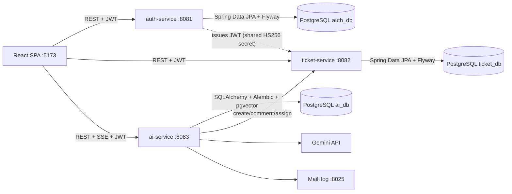

# Helpdesk — IT Ticketing Platform

An IT helpdesk / ticketing platform built as two independently deployable Spring Boot microservices,
backed by PostgreSQL and designed to sit behind a React front end. It covers the full lifecycle of an
IT support ticket: intake, prioritization with SLA deadlines, assignment, status transitions with a
full audit trail, comments, and operational reports (SLA breaches, ticket aging).

## Architecture



| Service | Port | Database | Responsibility |
|---|---|---|---|
| auth-service | 8081 | `auth_db` | Registration, login, JWT issuance, user & role management |
| ticket-service | 8082 | `ticket_db` | Tickets, comments, status history, SLA & aging reports |
| ai-service | 8083 | `ai_db` | AI multi-agent helpdesk: classification, RAG over company docs & past tickets, troubleshooting, escalation, ticket automation, notifications |

Each service owns its schema (migrated with Flyway) and its own database. The ticket-service never
calls the auth-service at runtime: it verifies JWTs locally using the shared signing secret and
trusts the `sub` / `email` / `role` claims.

## Tech stack

- **Backend:** Java 21, Spring Boot 3.5 (Web, Data JPA, Security, Validation, Actuator)
- **Database:** PostgreSQL 16, Flyway migrations, H2 for test slices
- **Auth:** Stateless JWT (jjwt), BCrypt password hashing, role-based access control
- **API docs:** springdoc-openapi (Swagger UI at `/swagger-ui.html` on each service)
- **Testing:** JUnit 5, Mockito, AssertJ, Spring Boot test slices (`@DataJpaTest`, `@SpringBootTest`)
- **DevOps:** Docker multi-stage builds, Docker Compose, GitHub Actions CI

## Repository layout

```
.
├── auth-service/          # Spring Boot app: users, roles, JWT issuance
├── ticket-service/        # Spring Boot app: tickets, comments, history, reports
├── ai-service/            # FastAPI + LangGraph: AI multi-agent helpdesk (Gemini, pgvector RAG)
├── frontend/              # React SPA (Vite)
├── knowledge-base/        # Markdown articles ingested into the RAG vector store
├── infra/postgres/init/   # Creates the per-service databases on first startup
├── .github/workflows/     # CI: test + Docker build per service
└── docker-compose.yml     # postgres (pgvector) + mailhog + all three services
```

## Getting started

### Option A — Docker Compose (recommended)

Requires Docker. From the repository root:

```bash
cp .env.example .env   # set GOOGLE_API_KEY for the AI helpdesk
docker compose up --build
```

### AI service bootstrap

On a **fresh** Postgres volume, `infra/postgres/init/02-create-ai-db.sql` creates `ai_db` with
the pgvector extension automatically. If you have an **existing** `pgdata` volume from before the
AI service was added, run the script once by hand (init scripts only run on empty volumes):

```bash
docker exec -i helpdesk-postgres psql -U helpdesk -d auth_db \
  -f /docker-entrypoint-initdb.d/02-create-ai-db.sql
```

Then ingest the knowledge base (requires `GOOGLE_API_KEY` in `.env`):

```bash
docker compose exec ai-service python -m app.rag.ingest /knowledge-base
```

Optional extras:

- **MailHog** UI at http://localhost:8025 shows the emails the AI agents send.
- Set `SLACK_WEBHOOK_URL` in `.env` to also get Slack notifications (no-op when unset).
- `POST /api/admin/index-tickets` (AGENT/ADMIN token) embeds RESOLVED/CLOSED tickets so
  similar past tickets surface in future analyses; this also runs at service startup.

## API overview

### auth-service (:8081)

| Method | Path | Access | Description |
|---|---|---|---|
| POST | `/api/auth/register` | public | Register (role defaults to `REQUESTER`), returns JWT |
| POST | `/api/auth/login` | public | Login, returns JWT |
| GET | `/api/users/me` | authenticated | Current user profile |
| GET | `/api/users` | AGENT, ADMIN | List users |
| PATCH | `/api/users/{id}/role` | ADMIN | Change a user's role |

### ticket-service (:8082)

| Method | Path | Access | Description |
|---|---|---|---|
| POST | `/api/tickets` | authenticated | Create ticket (SLA deadline derived from priority) |
| GET | `/api/tickets` | authenticated* | Search: `status`, `priority`, `assigneeId` + paging/sorting |
| GET | `/api/tickets/{id}` | authenticated* | Ticket details |
| PATCH | `/api/tickets/{id}/status` | AGENT, ADMIN | Transition status (validated state machine) |
| PATCH | `/api/tickets/{id}/assignee` | AGENT, ADMIN | Assign ticket |
| POST | `/api/tickets/{id}/comments` | authenticated* | Add comment |
| GET | `/api/tickets/{id}/comments` | authenticated* | List comments |
| GET | `/api/tickets/{id}/history` | authenticated* | Status audit trail |
| GET | `/api/tickets/reports/sla-breaches` | AGENT, ADMIN | Active tickets past their SLA deadline |
| GET | `/api/tickets/reports/aging` | AGENT, ADMIN | Ticket count + oldest age per status |

\* Requesters only see their own tickets; agents and admins see everything.

### ai-service (:8083)

| Method | Path | Access | Description |
|---|---|---|---|
| POST | `/api/assist/stream` | authenticated | Run the agent pipeline for a described problem; streams SSE progress frames (`started`, `node_start`, `node_end`, `result`, `error`) |
| POST | `/api/assist/{requestId}/create-ticket` | owner | "Create ticket anyway" — resumes a SOLVED run through the API agent |
| GET | `/api/assist/{requestId}/events` | owner | Replay persisted pipeline events (UI refresh recovery) |
| POST | `/api/analyze/tickets/{id}` | authenticated | Enqueue background analysis of an existing ticket (202) |
| GET | `/api/analyses/by-ticket/{id}` | authenticated | Latest analysis for a ticket (drives the AI-insights card) |
| POST | `/api/admin/ingest` | AGENT, ADMIN | Re-ingest the knowledge base (checksum-idempotent) |
| POST | `/api/admin/index-tickets` | AGENT, ADMIN | Embed RESOLVED/CLOSED tickets for similarity search |

The pipeline is a LangGraph state machine: `classify` → (`retrieve_docs` ∥ `retrieve_tickets`)
→ `troubleshoot` → `escalate` → `api_agent` → `summarize`, checkpointed in Postgres. The service
acts on ticket-service with two identities: the **employee's own JWT** (pass-through) for ticket
creation, and a self-minted 5-minute **service AGENT JWT** (seeded user id 9000, `ai@helpdesk.local`)
for AI comments and reads. Every LLM node has a deterministic fallback so the pipeline always
completes even if Gemini is unavailable.

### Ticket lifecycle and SLA

```
OPEN ⇄ IN_PROGRESS → RESOLVED → CLOSED
  └────────────→ CLOSED   (RESOLVED can also reopen to OPEN)
```

Invalid transitions (e.g. `OPEN → RESOLVED`) are rejected with `409 Conflict`, and every valid
transition is recorded in `status_history`. SLA windows by priority: CRITICAL 2h, HIGH 8h,
MEDIUM 24h, LOW 72h.

### Example flow

```bash
# Register and grab a token
curl -s -X POST localhost:8081/api/auth/register \
  -H "Content-Type: application/json" \
  -d '{"email":"jane@example.com","password":"s3cretPass!","fullName":"Jane Doe"}'

# Create a ticket (use the token from the previous response)
curl -s -X POST localhost:8082/api/tickets \
  -H "Authorization: Bearer $TOKEN" -H "Content-Type: application/json" \
  -d '{"title":"VPN down","description":"Cannot connect since 9am","priority":"CRITICAL"}'

# Log in as the seeded admin, promote Jane to AGENT, then work the queue
curl -s -X POST localhost:8081/api/auth/login \
  -H "Content-Type: application/json" \
  -d '{"email":"admin@helpdesk.local","password":"ChangeMe123!"}'

curl -s -X PATCH localhost:8082/api/tickets/1/status \
  -H "Authorization: Bearer $ADMIN_TOKEN" -H "Content-Type: application/json" \
  -d '{"status":"IN_PROGRESS"}'
```

## Testing

Each service has its own test suite (unit tests with Mockito, repository slices on H2, and a
full context smoke test):

```bash
cd auth-service && ./mvnw test
cd ticket-service && ./mvnw test
cd ai-service && pip install -e ".[dev]" && pytest   # unit + integration (no DB/LLM needed)
```

## CI/CD

GitHub Actions (`.github/workflows/ci.yml`) runs on every push and pull request:

1. **Test** — `mvn verify` for each Java service in a matrix, with Maven dependency caching;
   surefire reports are uploaded on failure.
2. **Test ai-service** — `ruff check` + `pytest` on Python 3.12.
3. **Build frontend** — `npm ci`, lint, type-check and Vite build.
4. **Docker** — builds each service image to catch Dockerfile regressions.

